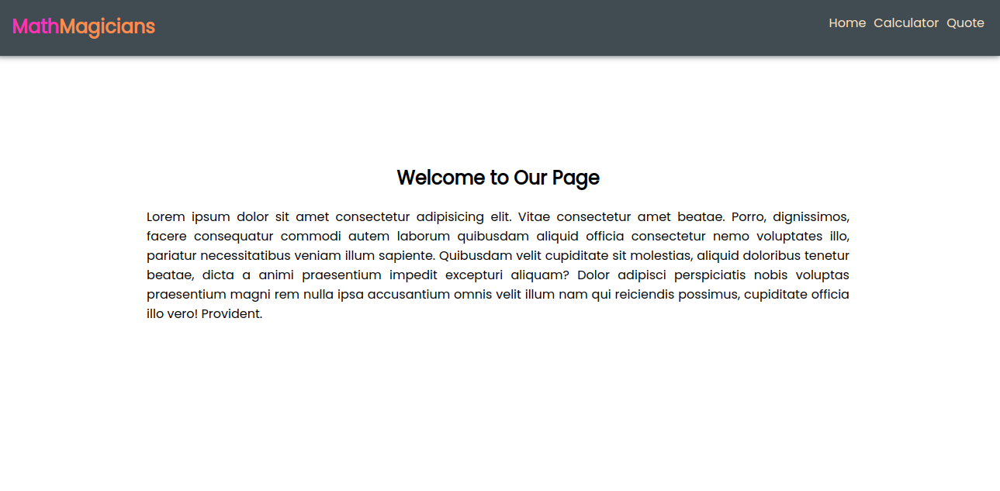
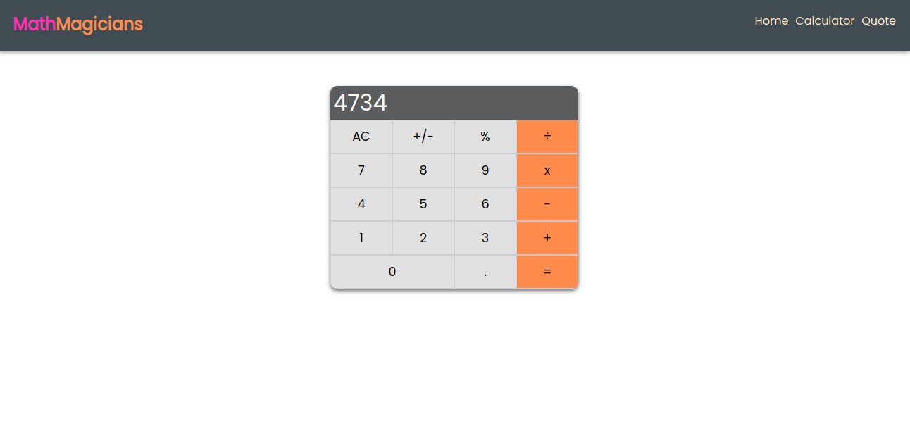
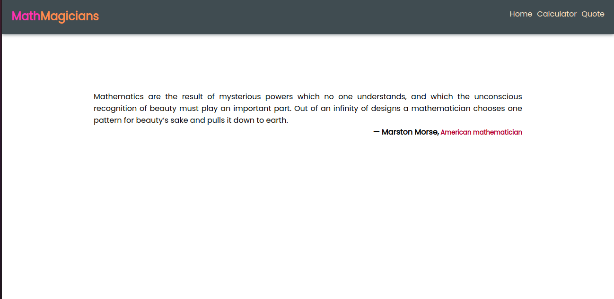

# math-magician-microverse

<a name="readme-top"></a>

<!-- TABLE OF CONTENTS -->

# 📗 Table of Contents

- [📖 About the Project](#about-project)
  - [🛠 Built With](#built-with)
    - [Tech Stack](#tech-stack)
  - [🚀 Live Demo](#live-demo)
- [💻 Getting Started](#getting-started)
  - [Setup](#setup)
  - [Prerequisites](#prerequisites)
  - [Install](#install)
  - [Usage](#usage)
- [👥 Authors](#authors)
- [🔭 Future Features](#future-features)
- [🤝 Contributing](#contributing)
- [⭐️ Show your support](#support)
- [🙏 Acknowledgements](#acknowledgements)
- [📝 License](#license)

<!-- PROJECT DESCRIPTION -->

# 📖 Math Magicians <a name="about-project"></a>

**Math Magicians** is a website for all fans of mathematics. It is a Single Page App (SPA) that allows users to:  Make simple calculations and read a random math-related quote..

## Screenshot








## 🛠 Built With <a name="built-with"></a>

### Tech Stack <a name="tech-stack"></a>

<details>
  <summary>Client</summary>
  <ul>
    <li><a href="https://html.com/">Html</a></li>
    <li><a href="https://www.w3.org/Style/CSS/Overview.en.html">CSS</a></li>
    <li><a href="https://www.javascript.com/">JavaScript</a></li>
    <li><a href="https://reactjs.org/">react</a></li>
  </ul>
</details>

<!-- Features -->

### Key Features <a name="key-features"></a>

- **Make simple math calculation**
- **Generate random math-related quote**

<p align="right">(<a href="#readme-top">back to top</a>)</p>

<!-- LIVE DEMO -->

## 🚀 Live Demo <a name="live-demo"></a>

- [Live Demo Link](https://carensiya-mathmagician.onrender.com)

<p align="right">(<a href="#readme-top">back to top</a>)</p>

<!-- GETTING STARTED -->

## 💻 Getting Started <a name="getting-started"></a>


### Prerequisites

- **ReactJs**
- **NPM**

In order to run this project you need:
 
1. To have installed Nodejs in your Code editor. In case you don't have it, go to this <a href="https://nodejs.org/en/">site</a>  and download the setup based on your PC
<p align="left">(<a href="https://nodejs.org/en/">install NodeJs</a>)</p>

### Setup

Clone this repository to your desired folder using the above command:

```sh
  cd my-folder
  git clone https://github.com/Caren-Koroeny/Math-Magician
```

### Install

Install this project with:

```sh
  cd my-project
  npm install -y
```

### Usage

To run the project, execute the following command:

```sh
  cd my-project
  npm start
```

Open <a href="http://localhost:3000/">http://localhost:3000/</a> to view it in the browser. The page will automatically reload if you make changes to the code. You will see the build errors and lint warnings in the console.

<p align="right">(<a href="#readme-top">back to top</a>)</p>

<!-- AUTHORS -->

## 👥 Authors <a name="authors"></a>

👤 **Caren Koroeny**

- GitHub: [@githubhandle](https://github.com/Caren-Koroeny)
- Twitter: [@twitterhandle](https://twitter.com/home)
- LinkedIn: [LinkedIn](www.linkedin.com/in/caren-siya-a89712180)

- 
<p align="right">(<a href="#readme-top">back to top</a>)</p>

<!-- Features -->
## 🔭 Future Features <a name="future-features"></a>

- [ ] **[Add good UI/UX]**

<p align="right">(<a href="#readme-top">back to top</a>)</p>

<!-- CONTRIBUTING -->

## 🤝 Contributing <a name="contributing"></a>

Contributions, issues, and feature requests are welcome!

Feel free to check the [issues page](../../issues/).

<p align="right">(<a href="#readme-top">back to top</a>)</p>

<!-- SUPPORT -->

## ⭐️ Show your support <a name="support"></a>

If you like this project, please don't forget to follow me and give it a star.

<p align="right">(<a href="#readme-top">back to top</a>)</p>


<!-- ACKNOWLEDGEMENTS -->

## 🙏 Acknowledgments <a name="acknowledgements"></a>

I would like to thank [Microverse](https://www.microverse.org/)

<p align="right">(<a href="#readme-top">back to top</a>)</p>

<!-- LICENSE -->

## 📝 License <a name="license"></a>

This project is [MIT](./LICENSE) licensed.

<p align="right">(<a href="#readme-top">back to top</a>)</p>